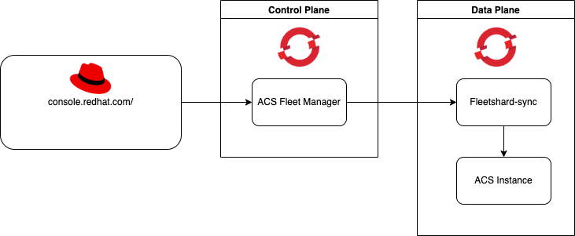
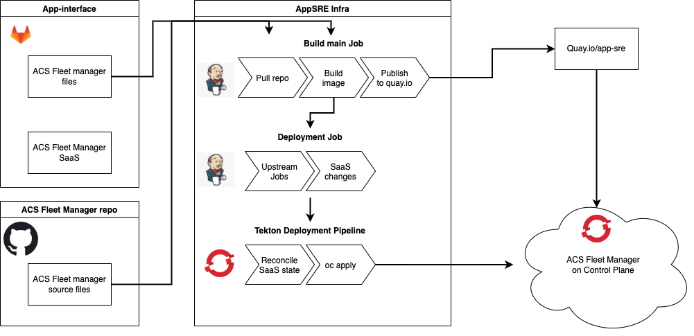

# ACS Fleet Manager

#### Table of Contents:

- [Service Description](#service-description)
- [Components](#components)
- [Technology stack overview](#technology-stack-overview)
- [Routes](#routes)
- [Dependencies](#dependencies)
- [Service Diagram](#service-diagram)
- [Application Success Criteria](#application-success-criteria)
- [State](#state)
- [Backup Policy](#backup-policy)
- [Deployment flow](#deployment-flow)
- [SLO documents](#slo-documents)
- [Grafana dashboards](#grafana-dashboards)
- [Alerts](#alerts)
- [Metadata](#metadata)
- [Resource Capacity and Growth](#resource-capacity-and-growth)
- [Data Continuity and Disaster Recovery](#data-continuity-and-disaster-recovery)
- [Data Loss Impact](#data-loss-impact)
- [Load testing](#load-testing)
- [Capacity](#capacity)
- [Runbook](#runbook)

### Service Description

ACS Fleet Manager allows [Red Hat Cloud Console](https://console.redhat.com/) users to request and
manage [ACS instances](https://github.com/stackrox/stackrox).

### Components

There are two main components in the system: ACS Fleet Manager and Fleetshard-sync.

- `ACS Fleet Manager` is hosted AppSRE OSD control plane cluster. Fleet Manager accepts user requests. It manages
  which `Fleetshard-sync` should provision an ACS Central instance.
- `Fleetshard-sync` is hosted on each OSD data plane cluster connected to the Fleet Manager. It is responsible to
  provision ACS instance on data plane cluster successfully.

### Technology stack overview

- The service is written in [Golang](https://go.dev/)
- It uses [PostgreSQL](https://www.postgresql.org/) for persisting data
    - Both stage and production environments run
      on [AWS RDS](https://aws.amazon.com/rds/?trk=4bfa3aee-a8ec-4199-b4d6-a92630a09e06&sc_channel=ps&s_kwcid=AL!4422!3!548987291221!e!!g!!amazon%20relational%20database&ef_id=EAIaIQobChMIjYmG49rr-QIVzIxoCR1o2gJ7EAAYASABEgKoKfD_BwE:G:s&s_kwcid=AL!4422!3!548987291221!e!!g!!amazon%20relational%20database)
    - [Gorm](https://gorm.io/index.html) ORM is used and [Gormigrate](https://github.com/go-gormigrate/gormigrate) for
      migrations
- The service uses Red Hat SSO
  for [authentication](https://github.com/stackrox/acs-fleet-manager/blob/main/docs/auth/jwt-claims.md)
- The service metrics are gathered by appSRE [Prometheus](https://prometheus.io/)

### Routes

The service provides a REST API. It is implemented according to
the [OpenAPI specification](https://gitlab.cee.redhat.com/service/web-rca/-/blob/main/openapi/openapi.yaml).

See [visual API description](https://api.openshift.com/?urls.primaryName=rhacs%20service%20fleet%20manager%20service).

API definition lists:

- List of [public APIs](https://github.com/stackrox/acs-fleet-manager/blob/main/openapi/fleet-manager.yaml)
- List of [private APIs](https://github.com/stackrox/acs-fleet-manager/blob/main/openapi/fleet-manager-private.yaml)
- List of [admin APIs](https://github.com/stackrox/acs-fleet-manager/blob/main/openapi/fleet-manager-private-admin.yaml)

### Dependencies

- The service is hosted on AppSRE OSD
- It uses AWS RDS for persistence
- RH SSO is used for authentication

### Service Diagram

See [miro ACSMS dashboard](https://miro.com/app/board/uXjVOh7XtrE=/)

### Application Success Criteria

The service provides [Red Hat Cloud Console](https://console.redhat.com/) users a way to create and
operate [ACS Central & Scanner instances](https://github.com/stackrox/stackrox).

### State

The service relies on AWS RDS. It persists user requests and desired state for reconciliation loop.
The RDS instance is provisioned via app-interface.

### Backup Policy

The service only has AWS RDS persistence. There is an automated backup configured.
Follow [RDS configuration](https://gitlab.cee.redhat.com/service/app-interface/-/blob/master/resources/terraform/resources/acs-fleet-manager/production/rds-pg14.yml)
on app-interface for more details.

There is
an [app-interface instructions](https://gitlab.cee.redhat.com/service/app-interface#restoring-rds-databases-from-backups)
about how to restore from the backup.

### Deployment flow

There are two triggers for the service deployment:

- New commit in the `main` [branch](https://github.com/stackrox/acs-fleet-manager/tree/main) in the GitHub ACS Fleet Manager repository.
- Any ACS Fleet Manager file is changed
  on [app-interface repository](https://gitlab.cee.redhat.com/service/app-interface).
    - The first deployment step is skipped if only ACS Fleet
      Manager [saas.yml](https://gitlab.cee.redhat.com/service/app-interface/-/blob/master/data/services/acs-fleet-manager/cicd/saas.yaml)
      is changed. It makes sense because `saas.yml` does not have any impact on the image, so there is no need to build a new one.

Deployment steps:

1. AppSRE JenkinsCI runs [build main job](https://ci.ext.devshift.net/job/stackrox-acs-fleet-manager-gh-build-main/).
    - It includes building an image from source and pushing it to the [`acs-flet-manager` quay.io repository under the app-sre organisation](https://quay.io/repository/app-sre/acs-fleet-manager).
2. The AppSRE JenkinsCI triggers a Tekton pipeline for the selected target namespaces. Look for "Pipeline Runs" on [this page](https://visual-app-interface.devshift.net/services#/services/acs-fleet-manager/app.yml)
3. Tekton deploys the latest version to the control plane OSD cluster.

### SLO documents

See: Control
Plane [SLO/SLI proposal document](https://docs.google.com/document/d/1P4zgZ1IYFD_wgYYfaT-AAQMe6afOVbt3YxORmNk7Bu4).

There is a list of
SLO [documents](https://gitlab.cee.redhat.com/service/app-interface/-/tree/master/docs/acs-fleet-manager/slos).

### Grafana dashboards

There are two ACS Grafana dashboards hosted on the appSRE Grafana instance:

- General service [overview dashboard](https://grafana.stage.devshift.net/d/D1C839d82/acs-fleet-manager?orgId=1).
- [SLO/SLI service dashboard](https://grafana.stage.devshift.net/d/T2kek3H9a/acs-fleet-manager-slos?orgId=1).

### Alerts

The service alerts are configured and located in
the [app-interface repository](https://gitlab.cee.redhat.com/service/app-interface/-/blob/master/resources/observability/prometheusrules/acs-fleet-manager-stage.prometheusrules.yaml)

### Metadata

The service metadata overview can be found in two places:

- AppSRE app-interface repository
  contains [ACS Fleet Manager metadata](https://gitlab.cee.redhat.com/service/app-interface/-/blob/master/data/services/acs-fleet-manager/app.yml)
- Also, it is available
  on [visual app-interface service page](https://visual-app-interface.devshift.net/services#/services/acs-fleet-manager/app.yml)

### Resource Capacity and Growth

The dev team expects that ACS Fleet Manager CPU, memory, and disk usage will grow proportionally to the number of users
for both OSD cluster and AWS RDS instance.
The number of running ACS Fleet Manager replicas can be configured via the `REPLICAS` environment variable in
the [saas.yml](https://gitlab.cee.redhat.com/service/app-interface/-/blob/master/data/services/acs-fleet-manager/cicd/saas.yaml)
file on app-interface.
The AWS RDS instance can be scaled with ACS Fleet Manager RDS resource configuration on app-interface
([prod](https://gitlab.cee.redhat.com/service/app-interface/-/blob/master/resources/terraform/resources/acs-fleet-manager/production/rds-pg14.yml)
and [stage](https://gitlab.cee.redhat.com/service/app-interface/-/blob/master/resources/terraform/resources/acs-fleet-manager/staging/rds-pg14.yml))

Factors which affect storage/database growth:

- ACS Fleet Manager retains information for each ACS instance for each user.
- ACS Fleet Manager retains information for each ongoing request for provisioning/deleting ACS instances.

Factors which affect CPU and memory usage:

- ACS Fleet Manager receives users requests from https://console.redhat.com.
- ACS Fleet Manager leader replica has a reconciler loop which handles all ongoing provisioning/deleting requests.

### Data Continuity and Disaster Recovery

- AWS RDS:
    - ACS Fleet manager uses only AWS RDS (PostgreSQL) for persisting critical data.
    - The AWS RDS instances are managed by the AppSRE team.
    - Both ACS Fleet Manager RDS instances resources are defined in app-interface
      repository ([prod](https://gitlab.cee.redhat.com/service/app-interface/-/blob/master/resources/terraform/resources/acs-fleet-manager/production/rds-pg14.yml)
      and [stage](https://gitlab.cee.redhat.com/service/app-interface/-/blob/master/resources/terraform/resources/acs-fleet-manager/staging/rds-pg14.yml))
    - In case of a database disaster, AppSRE would need to recreate that database and restore the latest backup.
      Also, it is possible to trigger restoring from the backup manually.
      Follow [appSRE instructions](https://gitlab.cee.redhat.com/service/app-interface#restoring-rds-databases-from-backups)
      for restoring RDS from the backup.
      Furthermore, ACS Fleet Manager deployments automatically check and apply schema migrations on startup.
      So, if migrations were lost in the disaster, deployment will automatically update an out-of-date schema.
- Local filesystem:
    - Local filesystems on pods do not have any business-critical data.
      Thus, no action needed for recovering data from the pod filesystem.

In summary, ACS Fleet Manager AWS RDS is the only critical data store that may need to be recovered following a
disaster.

### Data Loss Impact

If there is a disaster that results in the database losing data, and lost data was recorded after the last backup, then
the only option is to manually restore it using the ACS Fleet Manager logs.

Consequences of data loss may include but are not limited to:

- Provisioned ACS instance may disappear from users dashboard on https://console.redhat.com.
- Ongoing ACS instance provisioning requests might be lost.
- Ongoing ACS instance deleting requests might be lost.

ACS Fleet Manager does not retain or report any personally identifying information (PII) or critical financial records.
Losing data in ACS Fleet Manager due to a disaster only noticeably affects the displayed users of ACS instances
on https://console.redhat.com.
The ACS instances itself are hosted on separate cluster and should persist regardless ACS Fleet Manager AWS RDS lost
data.
Requesting a new ACS Instance after data loss should not have any issue.

### Load testing

See
app-interface: [ACS Fleet Manager load testing](https://gitlab.cee.redhat.com/service/app-interface/-/tree/master/docs/acs-fleet-manager/load-testing)

### Capacity

The current resource usage is available
in [Grafana dashboard](https://grafana.app-sre.devshift.net/d/D1C839d82/acs-fleet-manager?orgId=1).

### Runbook

Follow ACS Fleet
Manager [Standard operating procedure (SOP) on app-interface](https://gitlab.cee.redhat.com/service/app-interface/-/tree/master/docs/acs-fleet-manager/sop)
for detail instructions.
