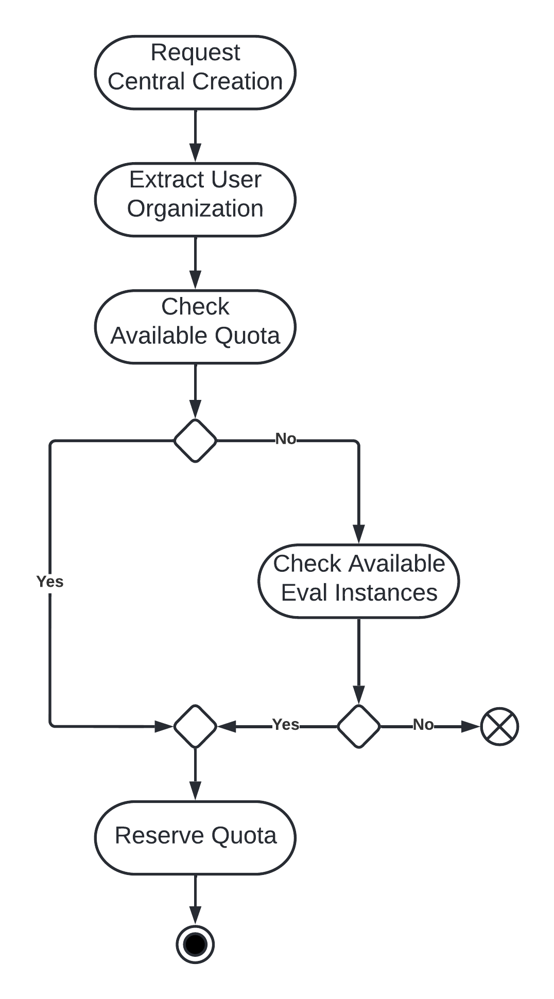

# Quota control

When fleet manager receives a creation request from a client, for example the Red Hat console,
the OCM token attached to the request identifies the user. The `org_id` claim of the token specifies
the Red Hat organization of the user. Quota is always assigned on the organization level. Fleet
manager then determines if the organization of the user has sufficient quota.

There are currently two quota backends -
[Quota Management with Account Management Service (AMS)](https://gitlab.cee.redhat.com/service/uhc-account-manager)
and quota management list (default). The CLI flag `--quota-type={ams,quota-management-list}` configures the
quota backend at deploy time of fleet manager. Production instances of fleet manager are configured with
`--quota-type=ams` to verify quota against customer's SKU entitlements.

## Instance types

Fleet Manager is able to create two types of Central instances:

- Eval instances
  - Instances of this type are automatically deleted after 48 hours by default.
    > NOTE: The `--central-lifespan` CLI flag of fleet mangager configures the life span.
  - All authenticated users that make use of the Fleet Manager can
    request the creation of a Central eval instance.
  - There is a limit of one instance per user.
- Standard instances
  - Instances of this type are permanent.
  - The user must have enough quota to create standard instances.

Fleet manager determines the instance type based on the quota of the user organization. If
sufficient quota exists, a standard instance is provisioned. If the quota has been exceeded or does
not exist, and the number of allowed eval instances has not been exceeded, an eval instance is provisioned.

## AMS

AMS is a service under the OCM umbrella. Its OpenAPI specification is available at
[api.openshift.com](https://api.openshift.com/?urls.primaryName=Accounts%20management%20service#/).
AMS maps the SKU entitlement of a user organization to a quota of cloud resources - in ACS's case
a Central instance. The SKU-resource mapping is defined in a
[spreadsheet](https://docs.google.com/spreadsheets/d/1HGvQnahZCxb_zYH2kSnnTFsxy9MM49vywd-P0X_ISLA/edit?usp=sharing)
owned by the AMS team.

AMS reads the SKU entitlements from two sources - Red Hat's IT services and
[ocm-resources](https://gitlab.cee.redhat.com/service/ocm-resources). The former integrates with Red Hat's
sale systems and marketplaces. The latter is a GitOps repository mainly used to assign SKUs to Red Hat
internal organizations.

To assign quota to an organization for testing or internal purposes, an entry to the organization's configuration
in `ocm-resources` should be added. Note that eval instances are mapped to a resource with cost zero. The limit
of eval instances is enforced by fleet manager itself based on the number of provisioned eval instances in its database.

### Billing model

AMS distinguishes between two resource types, which are separated by their `billing_model={standard,marketplace}`.
The standard billing model represents conventional subscription based SKUs. The billing and payment processing
done via Red Hat sales. The marketplace billing model represents metered SAAS-type SKUs, for which a marketplace -
for example AWS marketplace - handles billing and processing payments.

Fleet manager determines the billing model based on the available quota. If both `standard` and `marketplace` quota
are available, the instance is registered with a `standard` billing model.

## Quota management list

The type and the quantity of standard Central instances is controlled via the
[quota management list](../../config/quota-management-list-configuration.yaml).
If a user is not in the _quota management list_, only eval central instances are allowed.

### Adding organizations and users to the quota management list

To configure this list, you'll need to have the Red Hat account user's username
and/or their organisation id.

The username is the Red Hat account's username.

The organization is the Red Hat account's organization ID.

A practical way to get this information is by logging in to
`cloud.redhat.com/openshift/token` with the account in question, then login
to OCM with the OCM CLI and run the `ocm whoami` command to get information about that account.
In the returned output:

- `.username` is the Red Hat account's username.
- `.organization.external_id` is the Red Hat account's organization.

### Max allowed instances

If the instance limit control is enabled, the service enforces the `max_allowed_instances` configuration as the
limit to how many instances a user can create. This configuration can be specified per user or per
organisation in the quota list configuration. If not defined there, the service takes the default
`max_allowed_instances` into account instead.

The precedence of `max_allowed_instances` configuration is `org > user > default`.
